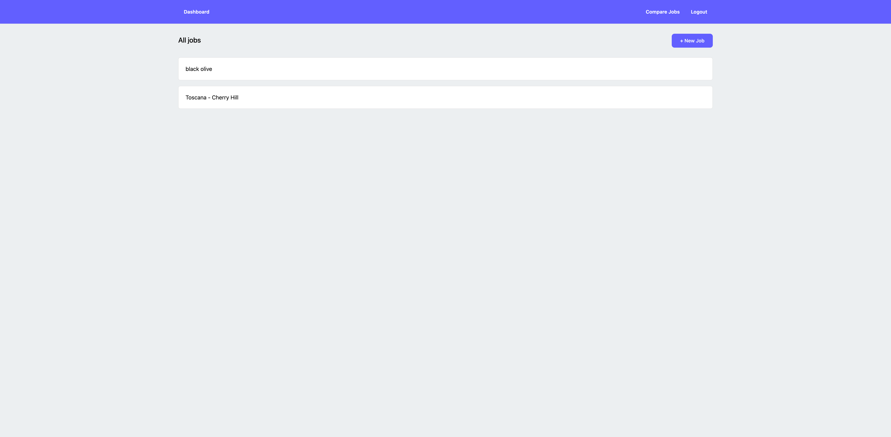
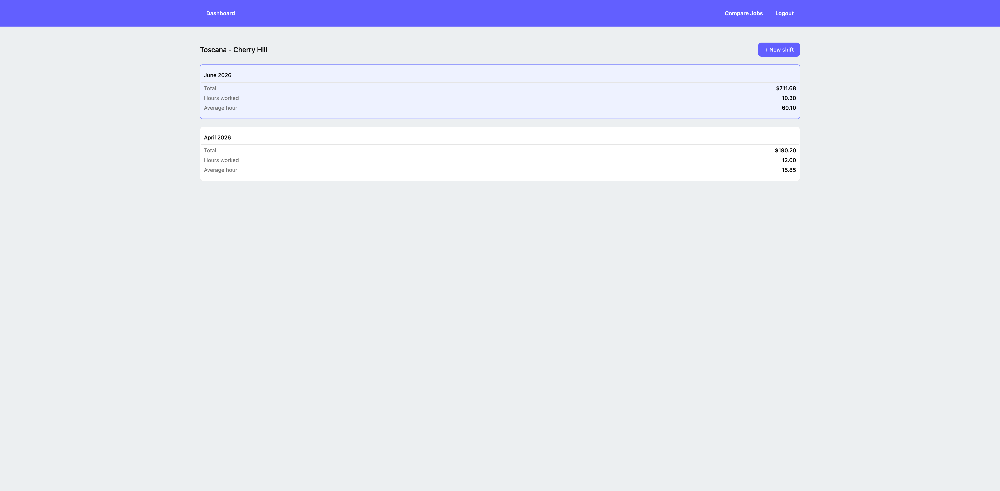
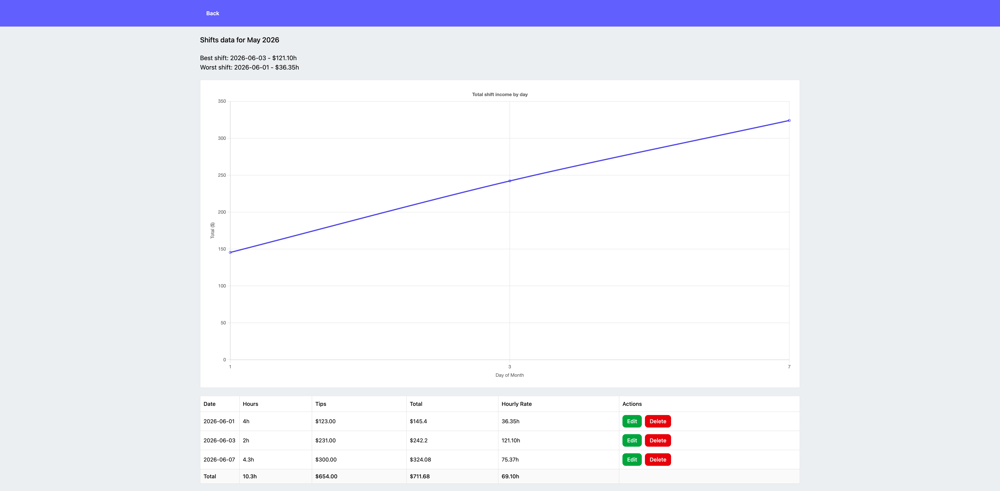
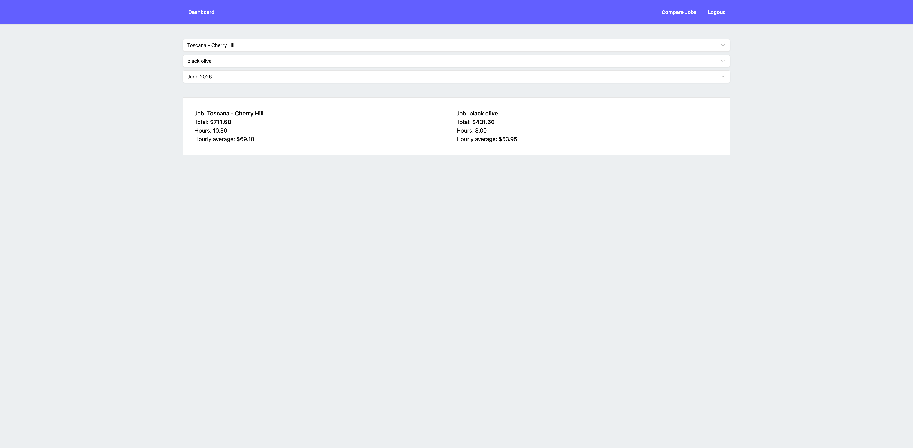

# Tip tracker app

Live demo: https://trackmytips.netlify.app/login

A React web-app for tracking earnings in a single or multiple jobs. This app helps you to analyze monthly income, total hours worked, average hour, compare jobs and store data for long periods of time.

## Features
- Create jobs and shifts for these jobs
- Track earnings and hours worked per job
- Monthly income breakdown for job
- View detailed shift history for each job
- Edit and delete shifts
- Compare two jobs ( total earnings, hours worked and average hourly rate )
- Generates best and worst shift for each month

## Tech Stack
- React.js
- Supabase
- Tailwind

## Database Schema
### userAccounts table
- userID: UUID
- email: text
- created_at: timestamptz

---

### job table
- id: UUID
- name: text
- hourlyRate: numeric
- userFK: uuid ( foreign key -> userAccounts.userID )
- created_at: timestamptz

----

### shift table
- id: UUID
- hoursWorked: numeric
- tips: numeric
- total: numeric
- date: date
- jobFK: uuid ( foreingn key -> job.id)
- created_at: timestamptz

## Preview
### Jobs Page

### View Jobs Page

## View Shifts Page

## Compare Jobs Page
